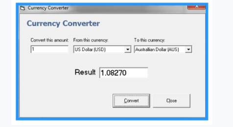

# Currency-Converter

Application provides a web-based interface for exchanging/converting money from one currency to another. It is developed using Ajax, which is Java library with web features. Such applications have used for business, shares & finance-related areas.

